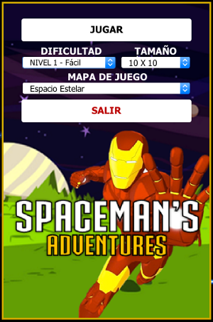

# ESIT ULL Grado de Informática
## INTELIGENCIA ARTIFICIAL. Desarrollo e implementación del Algoritmo A*, incluyendo una interfaz gráfica hecha en Java para su visualización.
### Realizada por Eduardo Escobar Alberto

#### **EJECUCIÓN: Haciendo uso del fichero .jar del repositorio.**

Inicialmente nos aparece un panel de selección de la configuración del programa, en el que podemos elegir los siguientes aspectos:

* **NIVEL DE DIFICULTAD:** Seleccionando desde el NIVEL 1 - FÁCIL (menos cantidad de obstáculos) hasta NIVEL 4 - EXTREMO (obstáculos insuperables).
* **TAMAÑO:** Tamaño del tablero de obstáculos. Indicado en número de celdas (10 x 10, 30 x 30, etc.).
* **MAPA DE JUEGO:** Cambia el fondo del tablero y las imágenes que representan a cada obstáculo. Simple cambio visual.
i